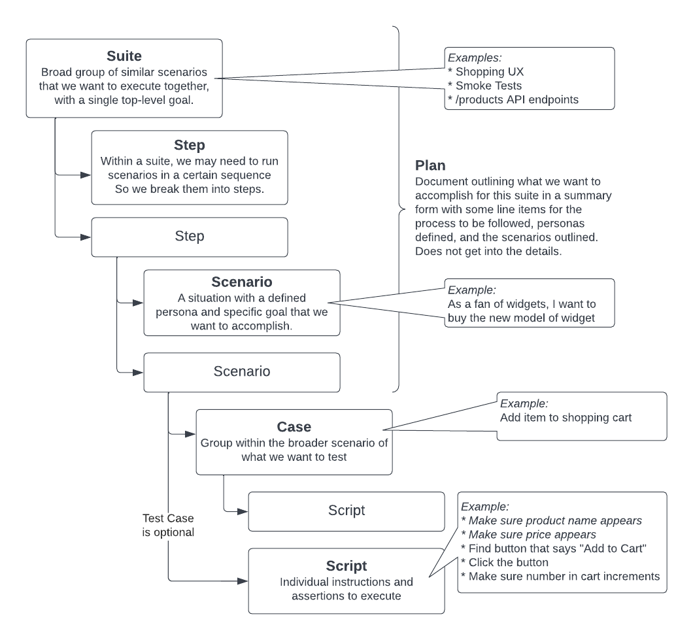

# What is QA Flag?

QA Flag is a test automation framework, written in TypeScript. The primary goals are creating a modern interface that is strictly typed. Once you learn the basics, your IDE's intellisense will do most of the work for you. But we have your back with great documentation and a helpful CLI.

The test suites can live conveniently along side the rest of your application's source files. QA Flag's modular design allows you to use it for a wide variety of web applications:

- **JSON** - REST, GraphQL and other APIs
- **Browser** - End-to-end UX testing with headless or headful browser (Playwright)
- **HTML** - When you don't need a full browser, DOM only tests are super-fast
- **XML** - XML APIs, including SOAP
- **Feeds** - RSS, MRSS or ATOM

# Core Concepts



These concepts are not unique to QA Flag. They are mostly standard ways to organize and plan your testing strategy. We'll start with the most granular and work up.

## Assertion

A single test that you want to perform is called an assertion. It is a statement that you make that you expect to result in a pass or a failure. Typically, this will be a `must` statement in QA Flag, but there are also less strict syntax varieties of `should` and `could` syntax.

Failure of a `must` will result in failure of the entire scenario. If a `should` case fails, the failure will be reported in the results but it is considered only a warning and will not fail the scenario. Lastly, a `could` case won't even result in it being reported but the result can be used in an `if` statement or other places to fork test script behavior.

Basic example:

```typescript
inputValue.must.equal("foo");
```

[More about assertions...](/docs/core-concepts/assertion)

## Test Case

A test case is a collection of [assertions](/docs/core-concepts/assertion) and other instructions. It will have a certain low-level goal of what it is trying to accomplish, for example "Add Item to Shopping Cart". It is a function that is called as part of a larger scenario, and the same test case may be re-used in multiple scenarios.

Inside of a test case is the **test script**, which is the list of individual instructions and assertions. So, for example, for our "Add Item to Shopping Cart" test case we need to do a few things:

- Wait for product page to load
- Product image must be visible
- Product title must be visible
- Product price must be visible and numeric
- Find the "Add to Cart" button
- Click that button
- Find the "Shopping Cart" icon in the top right
- Make sure the number now says 1 beside it

This list above makes up our "script" for this test case. Any of the individual statements with "must" are our assertions, but there are other line items that find things or click on things which are not assertions but still important parts of the script.

Test cases are completely optional in QA Flag, but they will help you organize large scenarios.

Define a case like this:

```typescript
@Case() async someNameForTheCase(context: PlaywrightContext) {
    // Your test script here
}
```

Call the case from within a scenario like this:

```typescript
await context.case(this.someNameForTheCase);
```

## Scenario

A scenario of tests that together cover a single path or user story. For UX or end-to-end tests scenarios, you might want to use the "As a `______`, I want to `______`" pattern to help define scenarios. A scenario should involve a certain persona that is trying to accomplish a certain action or expects a certain result.

For example: "As an _Android User_, I want to reorder the same coffee that I bought last week."

A scenario is made up of the individual instructions and assertions of a test script. Optionally, for large scenarios, you may use **test cases** to group those test scripts logically.

```typescript
@Scenario() async nameOfTheScenario(context: JsonContext) {
    // You test cases or test script here
}
```

[More about scenarios...](/docs/core-concepts/scenario)

## Suite

A test suite is a broad collection of related scenarios that you want to test. They may cover one area of the application, a class of tests (like smoke tests), or a group of similar use cases. Whatever make sense for your project.

[More about suites...](/docs/core-concepts/suite)

## Test Plan

Fot a given **suite** you will have a test plan. This is often a document that you might create before writing any code. It helps you outline what the structure of the suite will be and which scenarios and cases you'll need to execute it.

There is no code-level concept of a test plan within QA Flag; however, with the CLI you can print out the test plan for a given suite.

Use this command in your terminal:

```bash
qaflag plan
```

## Steps

Scenarios within a suite often have dependencies between them, so you want to control the order of exection. Even if you don't have dependencies between scenarios, if there are many scenarios your compute power may be impacted if they all fire at once. By default, all scenarios are grouped into "Step 1" and, when the suite runs, they will all fire off concurrently.

You control this order of execution, assign scenarios to a numeric step. Step 1 is always fully completed before moving on to step 2 and so forth. All scenarios in a single step will execute at the same time.

We (optionally) set the step when defining the scenario:

```typescript
@Scenario({
    step: 2
})
async someNameOfYourScenario() {
    // test script or test cases here
}
```

[More about steps...](/docs/core-concepts/step)

## Persona

This assigns an identiy to hypothetical user executing the scenario. The persona may have attributes defining their unique personality, device they are using, and authentication credentails. You most often will define personas to name certain types of user: "Android User", "Macbook User", etc. Other times you might use different authentication roles: "Admin User", "Standard User", "Unauthenticated User". But sometimes it may even make sense to give them more of a user story and personality and name them: "Susan, 40-year-old mother of two" and "Tyrone, 17-year-old track & field athlete".

[More about personas...](/docs/core-concepts/persona)

## Template

Often you will find yourself creating many similar scenarios with only minor differences. QA Flag allows you to create a template that can be re-used, so that you only have to specify what changes.

[More about templates...](/docs/core-concepts/template)

## Context

Once you write your first suites, you'll see us use `context` a lot. This is the root that you'll build off of in each scenario to find data from the response and make assertions.

[More about contexts...](/docs/core-concepts/context)
